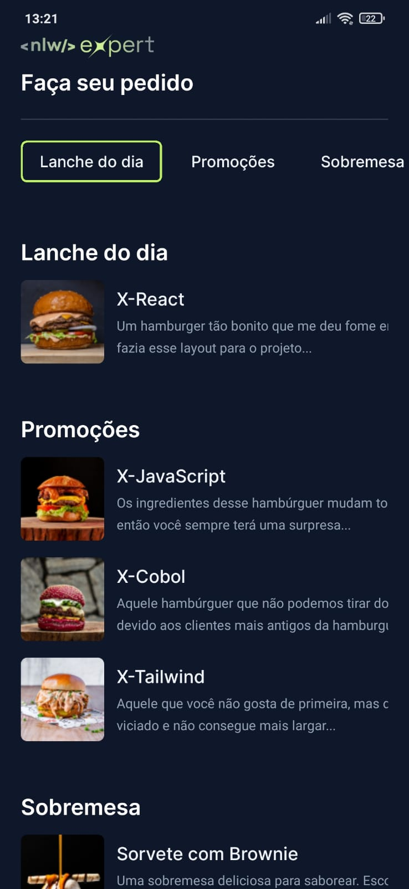
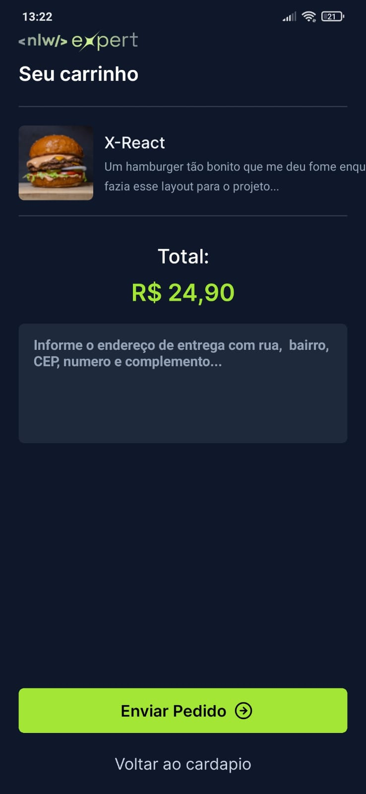

<h1 align="center"> App ecommerce</h1>

Projeto desenvolvido com tecnologias Mobile - React Native.

  <a href="#-tecnologias">Tecnologias</a>&nbsp;&nbsp;&nbsp;|&nbsp;&nbsp;&nbsp;
  <a href="#-projeto">Projeto</a>&nbsp;&nbsp;&nbsp;|&nbsp;&nbsp;&nbsp;
  <a href="#-layout">Layout</a>&nbsp;&nbsp;&nbsp;|&nbsp;&nbsp;&nbsp;
  <a href="#memo-licença">Licença</a>

  
 

 

  

  
 

## 🚀 Tecnologias

Esse projeto foi desenvolvido com as seguintes tecnologias:

- JSX - React Native
- Typescript
- Expo
- Git e Github

## 💻 Projeto

Loja ecommerce com integração api whatsapp

## 🔖 Layout

Para acessar o projeto é necessário ter instalado em sua máquina local o android studio.
Após instalação, clique na opçao: More Actions e selecione Virtual Manange Device (o simulador) em seguida execute o seguinte comando
no terminal integrado do VSCode: npx expo start.

A segunda maneira de visualizar o app e instalando o  aplicativo 'EXPO GO'  na loja de aplicativo de google play. Após instalação, execute o projeto no computador com o comando
npx expo start, essa ação vai mostrar um qrcode na tela, ao fazer a leitura o qrcode, conseguirá acessar o aplicativo

Obs.: Como se trata de um projeto inscrito em Typescript é necessário instalar as dependências
(bibliotecas necessárias para o funcionamento do app), usando o comando: npm install.

## :memo: Licença

Esse projeto está sob a licença MIT.

---

Feito com ♥ by :wave: Arnóbio Aires